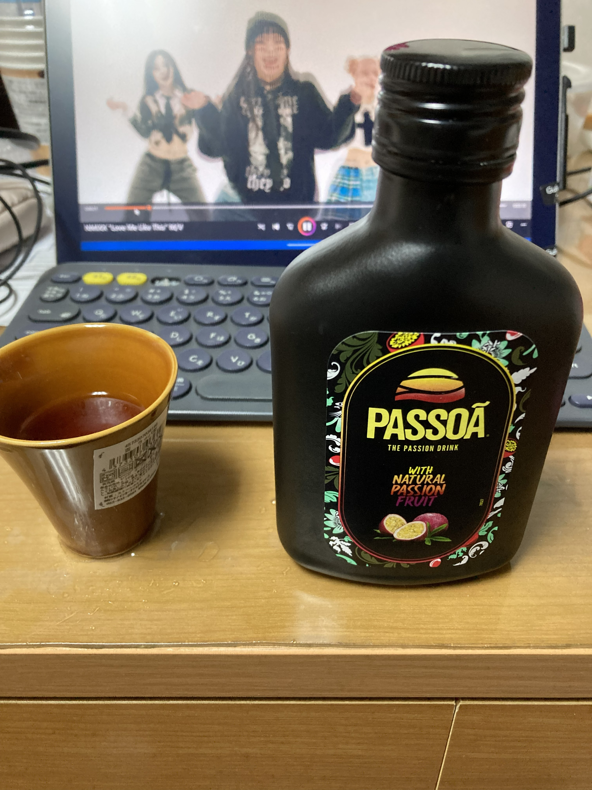

+++
title = "第一航海の仕込み決算"
date = 2026-10-01T00:00:00+09:00
draft = false
tags = ["船", "お金"]

+++

新しい仕事は高給取りとは言いにくい仕事です。なので、そろそろ、お金を計算しないとなと思って計算してみる。
**仕込みで使ったお金を計算してみた。**

- 食事手当４食分+2000円
- 兄への誕生日プレゼントギフト-1000円
- 電源コードライトニング-1750円
- ノドグロ4貫-486円
- 穴キュウ巻き-378円
- パッツァフラスク（果実酒）200ml-935円
- 電気ケトル-2980円
- 敷布団洗濯バスケット枕マグカップ-6687円
- マグネット、懐中電灯、マグネット、電池-440円
- カップ、おちょこ、本立て、ペン立て-555円
- シーチキン、缶ジュース、ポテトチップス、チョコ、寿司とパン、ヨーグルト-4532円
- コーヒーカップとアイス-520円   
累計-18263円の支出でした。
ケトルと布団の9667円を除くと、毎回8596円ほど仕込みに必要なのかなと思います。
次回の停泊時のお金も計算して、比較してみたいです。

買ったお酒をあっためたお湯で割って飲んでみた。このあと、おちょこは落として、割った。船に陶器はだめですね。
相変わらず、エンミックスの動画を見ています。
- git add .
- git commit -m "Add new post"
- git push 
この呪文で、記事を更新します。