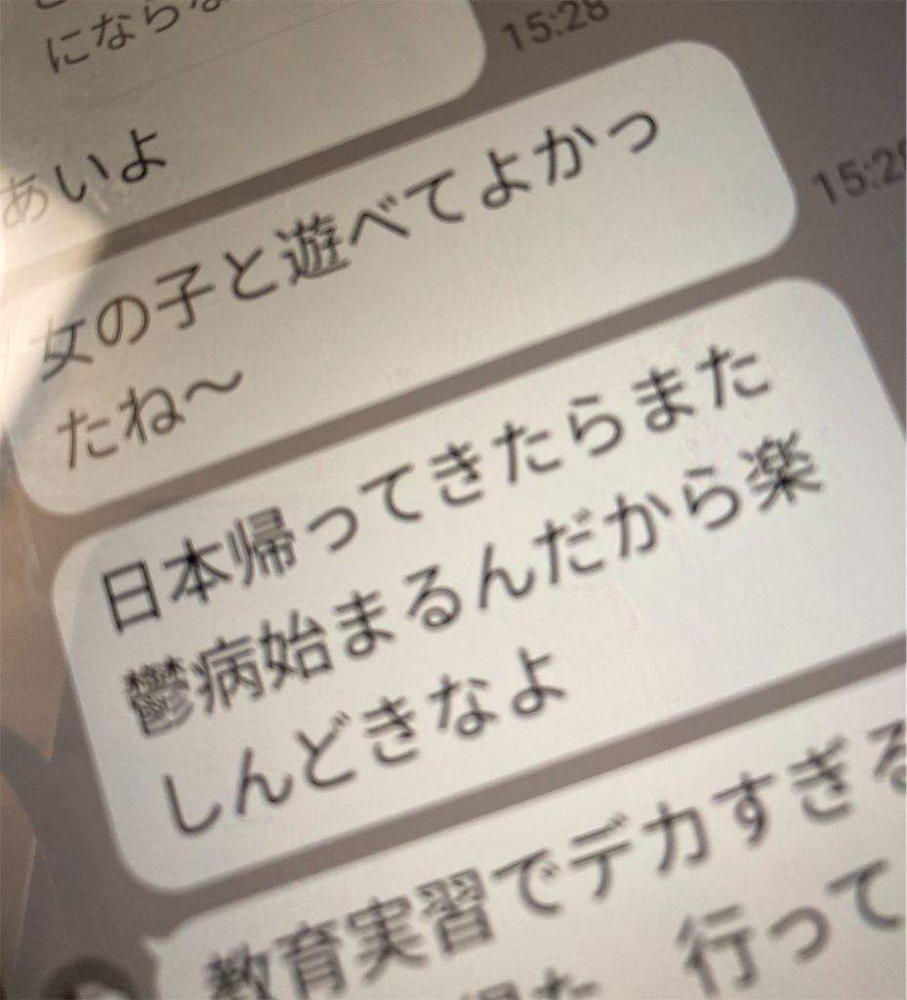

+++
title = "MMさんありがとうございました。"
date = 2026-10-05T00:00:00+09:00
draft = false
tags = ["船", "仕事", "女", "大学での学び"]

+++

今日の仕事は、抜びょうでした。天候が悪いため、朝7時30から主機を動かしたのちに、ウインドラスを動かしていかりを巻き上げました。
私の役目は、アンカーチェーンの収納庫内できれいに畳んで入れる役割の機関士が「ストップ」と言ったら、甲板に伝える仕事でした。  
仕事が終わり、機関場に戻ったら一等機関士が軍手を付けずにいたことについて、指導してきました。今度から気を付けたいです。    
また、今日は朝から気持ちが沈みがちで、上手く喋れなかったり、うまくいかないように感じましたが、10時を過ぎるころには元気になりました。毎日同じリズムで生活するので、精神面の変化に気を遣いたいです。  
**先輩との会話では、大学の友人であるMMさんの話で盛り上がりました。**  
私の仕事は当直業務なのですが、見習い期間なので先輩機関士と一緒に働いています。その際、3時間に一度の記録業務や多少の掃除くらいしか仕事がなく、退屈です。  
そこで、先輩と会話をよくします。結構論理的な先輩にダメ元で占いの話をしたら、意外と占い好きらしくて、驚きました。
そのあとは、大学の友人のMMさんの話をしました。
MMさんは、大学の同じ学部の同期で一番面白かった人です。彼女の特性を説明します。
- めちゃくちゃ美人: 身長が170㎝近くあってスラっとしててスーツパンツを着ると足が長くてすごくキレイに見えます。小顔でシャープでおでこがエロかったです。そしてオシャレでイケてます。
- めっちゃ内向的: 就職活動の面接や、大学での交流に不安がありました。言いたいことはメッセージでは言えますが、対面では何も言えませんでした。
- 世の中をなめている: その美貌からか、色んな人に助けてもらっていたのか、教育実習に行くまで本気を出したことがありませんでした。
- まじめ: 教員免許を取得したり、堅実にものをこなすことが出来ました。それに加え、他人に合わせなきゃという意識が強かったです。  
MMさんと仲良くなったのは、大学2年生の頃、一緒にラーメン屋さんに行ったのがきっかけです。私は女性の友達が本気でほしかったので、MMさんと同じ苗字の有名人を調べたりして食事に挑んだのを覚えています。
その時の反応は、「私の母と同じ名前だ。」でした。  
MMさんが面白いのは、そのツンデレ加減です。なんか、私と一緒にいると恥ずかしいのかメッセージでは「キモい」「生きていて恥ずかしくないの？」とかひどいことを言ってくるのですが、
食堂などで会うと、「一緒に食べる？」と誘ってきたり、授業で隣に座ってきたり、同じバイト先で働いてみないか？と言ってきたり、と言う感じで落差が凄く親密な感じです。所謂悪友という関係でしょうか。  
特に面白かったのは、私が、筑波大学の交友関係へ不満をこぼしてジャカルタに留学に行った際、私がジャカルタの女の子は筑波大学と違って優しい。と言ったら、
「日本帰ってきたらまたうつ病始まるんだから、楽しんでおきな。」と返信がきたことです。そのとき、私がうつ病になるのは確定なのかよ！とつっこみたくなりました。

（実際にうつ病のようになった話は、後日書きたいと思います。）  
私は関係の中で、MMさんに「美貌があって頭もよくて羨ましい。」とずっと褒め続けていました。
MMさんの彼氏と3人で食事に行った際にもそのように言っていたので、最終的には、MMさんの彼氏（３つ上の院生）から脅迫文が届いて、さすがにメンドクサイなと思ってやり取りを控えるようになりました。  
（卒業式で、向こうから体を近づけて一緒に写真を撮ってくれたので、MMさん本人に嫌われてはないかなと思っています。）  
こんな感じのMMさんのツンデレエピソードを先輩にしたのですが、結構ウケて嬉しかったです。私は、ただ友達の話をしているつもりなののですが、MMさんの話はウケがいつもいいです。

MMさんについて、文章にして振り返ってみると大切なことをいくつも気付かせてもらったな。と思います。たとえば、中高ともに男子校だった私にとって一緒にいるだけで
「めっちゃエロい！！魅力を感じる！！」と思えるような相手と接近したのは初めてでした。「脳内で考える最も美しい存在より、クラスの女の子の方がキレイなので、毎回想像を超えてくる。」と授業にいく度に思っていました。  
しかし、そのような相手が、超陰キャで、口悪くて、苦労が足りないうえに才能を活かしきれていないのを見て、美しいだけで全然ダメじゃん。と思いました。なので、眉目秀麗な女性の内面への幻想を早めに捨てることが出来ました。
そして、ある経験から、もう一つ大事なことも気付かせてもらいました。MMさんが彼氏と同棲していたことも知らないでふたりでご飯食べていた時、私が「大学で寂しいことが多い。」
とこぼしたら、「彼氏いるのに今日も朝告られちゃったんだよね。モテキ来たかも。」と返してきて、帰って泣くくらい辛い思いをしました。筑波大学で悔しいと思ったのは、それが最初で最後です。
その気持ちを分析したら、彼氏のことを1ミクロンも羨ましいと思えなくて、むしろMMさんに嫉妬していた自分に気付きました。私は「美女を手に入れたい願望」より、「美女みたいにモテたい願望」が強いタイプなんだなと気づくことが出来ました。     
なお、MMさんは私の嫉妬や彼氏がいる事への落胆をよそに、その食事の最後「沢山話せてめっちゃ楽しかった。」と言っていました。  

まとめると、MMさんには、感謝でいっぱいです。というのも、MMさんとの友人関係を通じて、私自身の欲望や異性への理解を深められたからです。また、クラスの他の子にMMさんの意外な様子を共有して笑い話に出来たり、  
彼氏にわけわからんことを言ってもらったおかげで、当時計画していた同人誌の執筆に火がついたからです。
卒業してからも、直接のやり取りはないものの職場や雑談の場面で何故かウケる鉄板ネタとして話せることも感謝しています。
