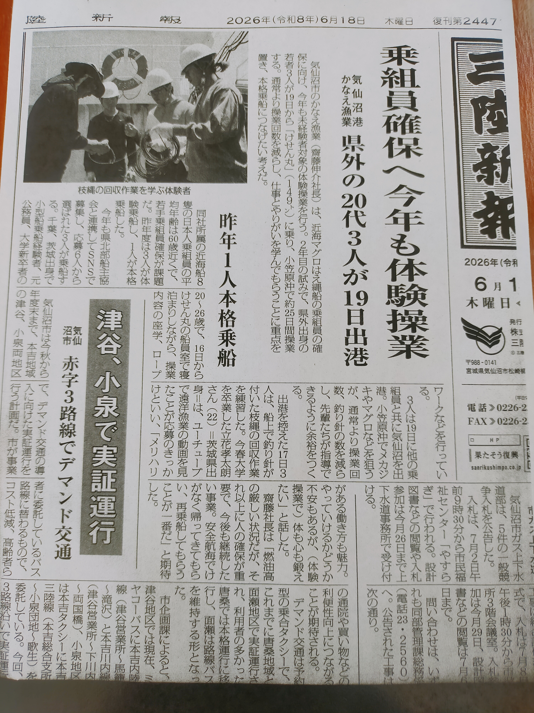

+++
title = "船乗りになって起きたこと3"
date = 2026-10-08T00:00:00+09:00
draft = false
tags = ["船", "仕事", "キャリア"]

+++
今日本当は、お風呂掃除の当番だったのに全然当番表を見ていなくて、朝ごはんを食べたあとに急いでやりました。これからは、カレンダーに書いていこう。と言われて、気を付けたいと思いました。
そして、機関長の苗字を間違えてしまい恥をかきました。自分は母音で名前を覚えているとよく思います。
今日は停泊時の当直の当番を決めました。その仕事は9時から21時と次の日の朝6時があり、3時間ごとに記録を取ったり掃除をしたりする仕事で結構拘束時間が長いです。その分ずっと機関場にいる必要はないです。  

今日の仕事は、サデ曳きで使うクレーンやウインチの点検でした。甲板員がメインで機械に注脂していました。
グリースポンプという道具を初めてみましたが、中にグリースを詰めて機械の中に注ぐために使う道具でした。

私は甲板での仕事はほとんどありませんでしたが、久しぶりにずっと立っていたので疲れたり眠くなったりしました。
やったことは、機械からカバーを外したり、点検が終わりカバーを元に戻した時くらいです。
一応、機械を動かすために発電機を並列運転させる仕事を機関場ではしました。  

今日は、以前も書いた船乗りになって起きたことの続きを書きたいと思います。
**新聞の1面に載った**  
船乗りになって面白かったことの一つに、新聞の1面に載ったことがあります。

参加した近海マグロ漁船操業体験プロジェクトについての記事が三陸新報の1面に掲載されて、私の操業への意気込みのコメントが実名付きで載りました。
近海マグロ漁船操業プロジェクトとは、3人程度の応募者を集め、サメやメカジキを狙う近海マグロ漁船での体験操業を1か月ほど行い、正規雇用で給料も出るというインターンシップ的な企画です。
何故、新聞の1面に乗ったかと言うと、このプロジェクトには二重の新規性があったからです。
第一に、沖に長期間出る漁業というのは労働内容がブラックボックスになりがちで、船員保険に加入が必須なのもあり、なかなか体験のハードルが高かった。しかし、それを行ったこと。
第二に、実習船というのは非常にコストのかかるもので、商船三井などの大企業しか持っていなかったが、それを気仙沼のかなえ漁業という小規模な会社が行ったこと。
だから、この記事が1面になったのだと思います。私は、乗船の際「1航海にかかる費用は約2000万円、体験でペースを落とすと水揚げは700万円ほどになり、会社の手出しは1000万円を超える。その覚悟をもって取り組んでくれ。」と社長に激励されました。

この企画には洋上での実習に加えて、出船の前に5日間船の上で寝泊まりして、その間に社長から会社概要の説明、Japantunaの吉田さんから危険性や年収の説明、日本人乗組員との顔合わせ、漁労作業の練習、会長からのメンタル指導などが行われていました。
取材が入ったのは、出船の前日でした。少し面白かったのが、女性記者からの取材を断ったことです。何故なら私が乗った漁船は女人禁制の船で、乗組員の家族ですら船に乗ることが出来なかったからです。実際船に乗って受けた囲み取材は男性記者だけでした。
また、記事の中で、私が茨城県出身と記載されていますが、それは誤りで私の出身は千葉県市川市です。他の体験乗船者と間違われたのだろうと思います。

この新聞の1面に載ったことでありがたいことが起きました。
それは、今の仕事に繋がったことです。というのも、私が近海船の継続乗船を熟考の末諦めた時、近海マグロ船が所属する宮城県北部船主協会で私のことが新聞の記事とともに話題になったらしく、漁船ではない今の仕事を紹介してもらえました。
お陰で、近海船と異なり安定した睡眠時間と余暇の時間がある労働環境になり、今このブログを書くことが出来ています。漁師を諦めた理由の一つに、執筆活動に未練があったというのがあったのですが、
今の生活は執筆活動を優先する方向性ではかなり理想的な環境で、満足できています。なので、船の仕事を始めてから、まわりが自分の人生を応援してくれているように思うようになりました。

最後に一つ面白い逸話をば。体験操業が終わり気仙沼の骨董店になんとなく立ち寄って店長と立ち話をしたときのことです。
店長は、かなり見る目がある人で、私が漁師であると伝えると、「君みたいな人の話を聞くタイプの子が漁師やってるっていうのは凄いなぁ。」「ため込むタイプだから、海で人を殺すようなことがないように。」「君は三陸新報に載って有名人になるんじゃない？」
と言われました。その際に、一緒にいた体験乗船者に「もう載ってます！」と突っ込まれていました。  

