+++
title = "油絵好きなのはこの人がいるから"
date = 2026-10-11T00:00:00+09:00
draft = false
tags = ["船", "美術", "油絵"]

+++
昨日は入港日でした。そのあとあちこち行ったり飲酒したりして、日記を書く時間を取れなかったので、次の日の晩に振り返っています。
朝から主機をかけて、揚錨をしました。
主機をかけた際に、前回機械を停止した時に調速機のノブを押し込んでしまっていたらしく、停止する際に引っ張たら、そのままでいいと言われました。
次回から気を付けたいです。
入港の際には函館の海上自衛隊の護衛艦が見えたり、Ocean interventionと書かれた黄色い船が止まっていたりしました。
歴戦の元マグロ漁師の船員からは、船体が白と赤で塗られているのがマグロ船だ。と教えてもらいました。
甲板部のおもてにいましたが、やるべきことが全然分かりませんでしたが、入出港は沢山ある船なのでこれから覚えていきたいです。
また、入港作業が終わった後も、停泊用発電機に切り替えて、エアコンもその電源に切り替えました。また、タンクの残油をおもり付きの巻尺ではかっていました。  

いつもは、日記の後に小噺を書いているのですが今日はすごくlazyでブログを書く気力がわかなかったので、画像メインですむ絵画の話をしたいと思います。
洋上だとネットが無く、暇すぎて、保存した画像やプリントした画像で美術を楽しむことも立派な娯楽になります。
私は大学3年生の3月にDIC川村記念美術館に行き、大学4年生の12月から近代美術に傾倒するようになりました。
川村記念美術館では、ロスコ・ルームと呼ばれる特殊な展示部屋があり、そこが一番感動したのですが、その後さまざまな絵画を見るようになり、総合的に一番好きになった画家はキスリングです。
というのも、ロスコの絵は、高速で突っ込んでくるダンプカーが目の前にあるような避けられない死を予感させます。
しかし、キスリングの絵は、理想化された部分と写実、鮮やかな色遣いと昏い表情など相反する要素があります。その矛盾によって生まれるエネルギーを最大限発揮して、生命力やずみずしさを感じさせます。
キスリングの絵を見た時の感覚は私がマグロ船の揚縄の様子をYouTubeで見た時に近いです。「こんな生命エネルギーがあるんだ」という憧れを感じます。同じ理由でエロい絵多いですね。
また、絵から漂う異国情緒から、誰とも重なり合わない部分が大きかったのだろうなと感じさせます。
矛盾する感覚、鮮やかな色彩、異国情緒、自分と重なる部分がとても多いと感じるので、凄く好きな画家です。この人がいなければ、油絵への情熱はそこまで高くならなかっただろうと思っています。
私が実際に目で見たキスリングの作品をあげていきたいと思います。  
**姉妹**
  
大学3年生の3月に川村記念美術館の常設展で見ました。画像はネット上のブログから転載。  
**ファルコネッティ嬢**
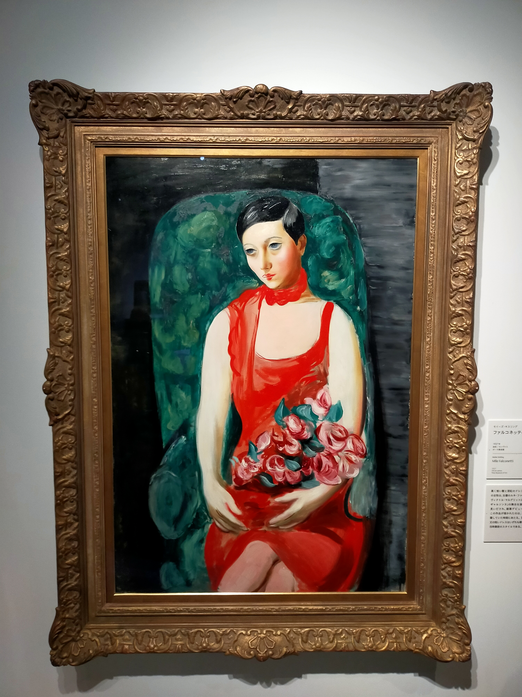
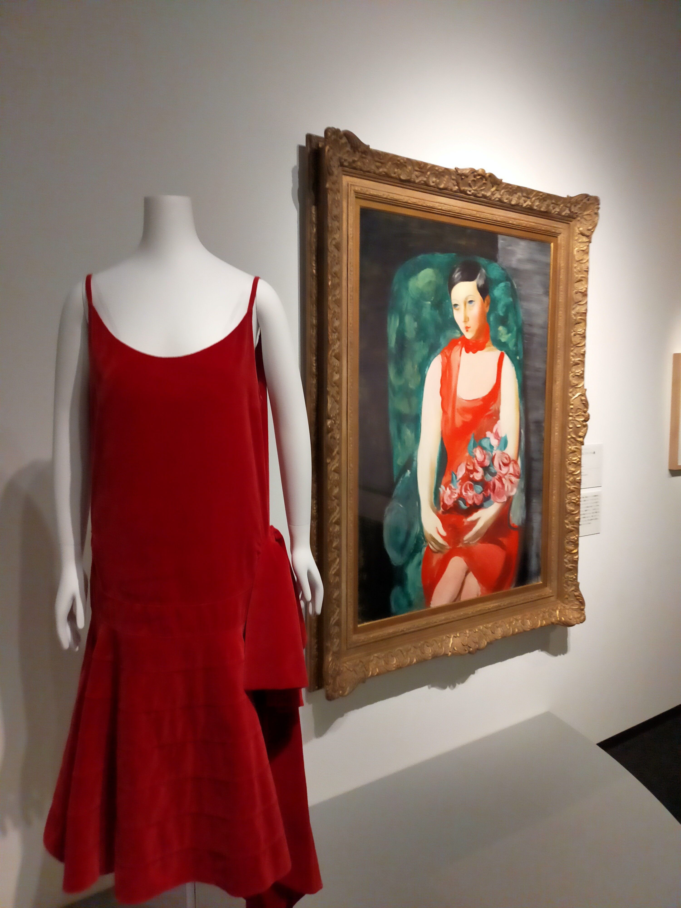  
大学4年生の1月に三菱一号館美術館のアールデコ展で見ました。当時の洋服と並べて展示されていました。  
**花（池田大作コレクション）**
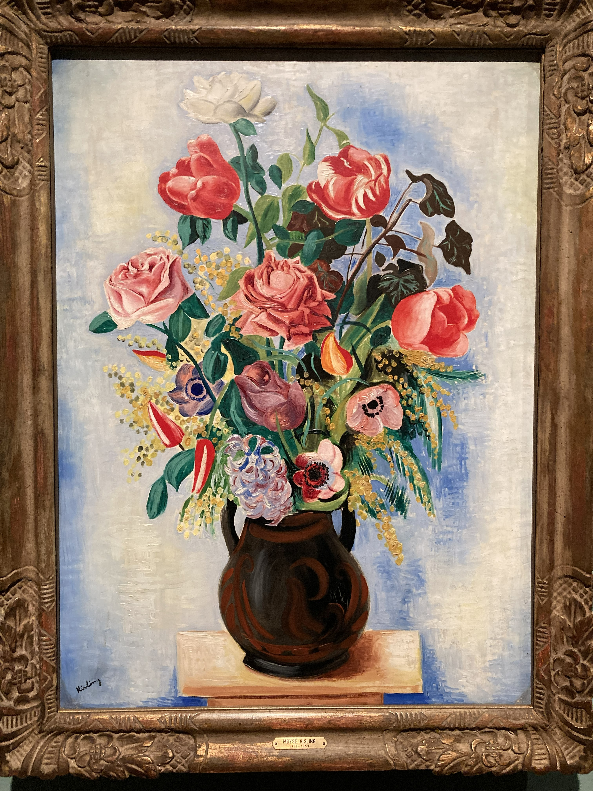
マグロ船に乗る前の4月に京都市美術館に来ていた池田大作コレクションで展示されていました。名前の綴りも間違っていたし、不愉快でした。  
**リタヴァンリアの肖像**
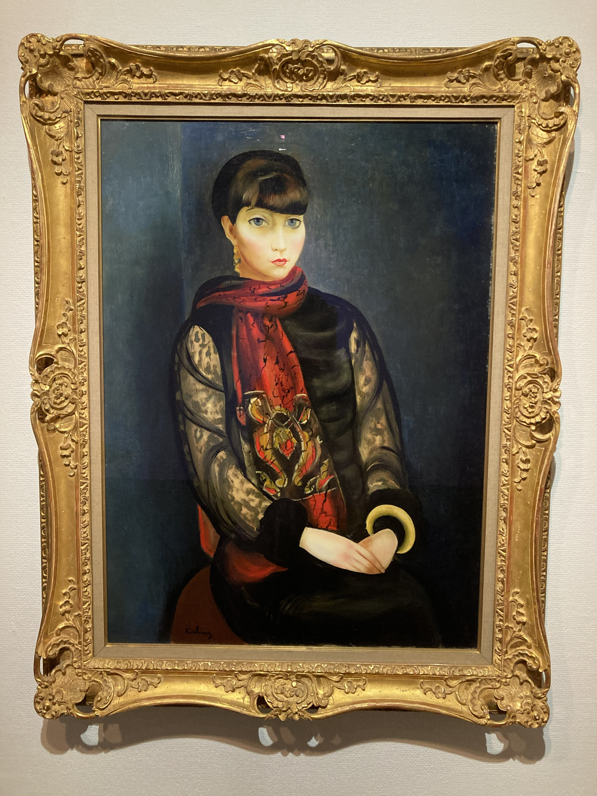
マグロ船に乗る前5月に埼玉県立近代美術館のコレクション展で見ました。最初見た時は、本当に人がいると思い驚きました。隣に静物画もありましたが、あまり記憶に残りませんでした。  
**カーテン前の花束**
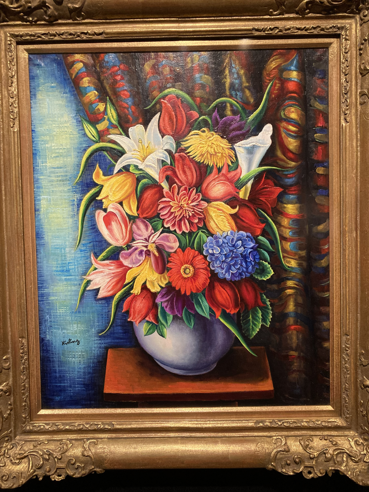
マグロ船に乗る前5月に村内美術館で見ました。日本で一番多くのキスリング作品を所蔵している美術館で、入場料も安く大変良心的な美術館です。常設で6作品展示しており、ここに行けば必ずキスリングの絵が見れるという数少ない美術館です。  
  
(マグロ船後の8月に池田20世紀美術館の常設展で「モンパルナスの女」を見ました。有名作「女道化師」も所蔵していますが、岡山に貸し出し中でした。ここも、行けば必ずキスリングの絵が見られる美術館です。)

これから見たい国内のキスリングの作品をあげていきたいと思います。  
**オランダ娘**
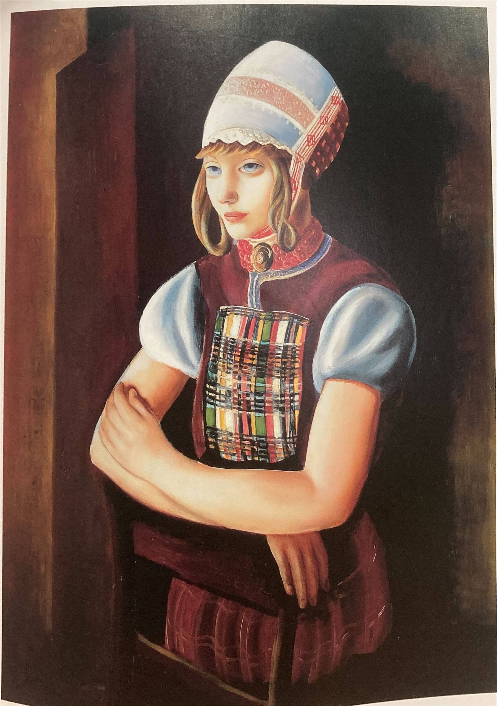
この絵を画集で見ると泣きそうになります。大阪中之島美術館にありますが、あそこは常設展がないので、なかなか出てきません。コレクション展があるまで待たなければなりません。  
**ジョゼット**
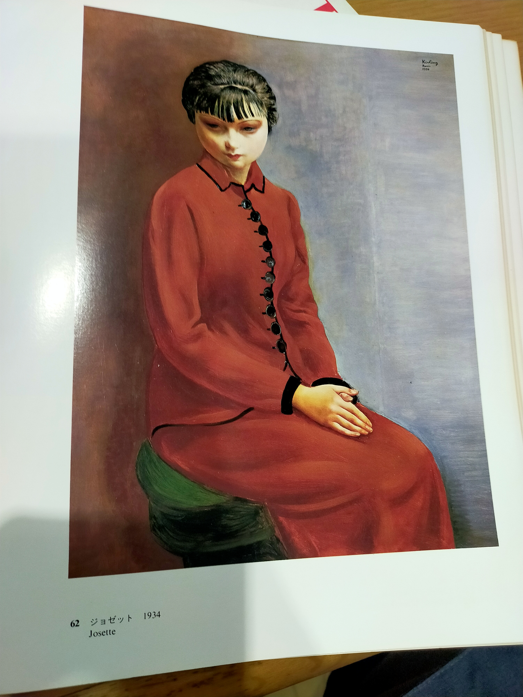
この絵は死ぬまでに絶対見たい絵の一つです。画集でしか見たことがありませんが、人物から放たれるエネルギーがハンパないです。
山形美術館にあります。しかし、服部コレクション「静物と室内風景/肖像と人間」が展示される年に2か月しか見ることが出来ません。そして、私は今年見れなさそうです。  
**メキシカンガール**
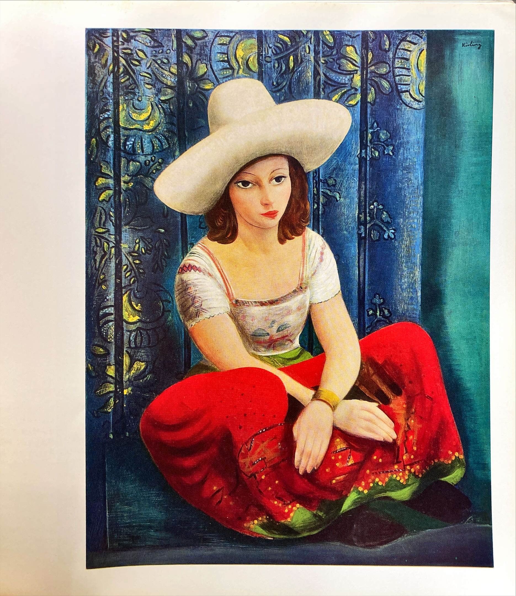
多分個人蔵ですが、日本にあるんじゃないかなと思っているキスリング作品です。色遣いがサイコーだと思います。    

あとは多分ホテルオークラがいいやつを結構持ってると思うんですけど、現在見ることはできません。

これから見たい海外のキスリング作品をあげていきたいと思います。  
**イングリッド**
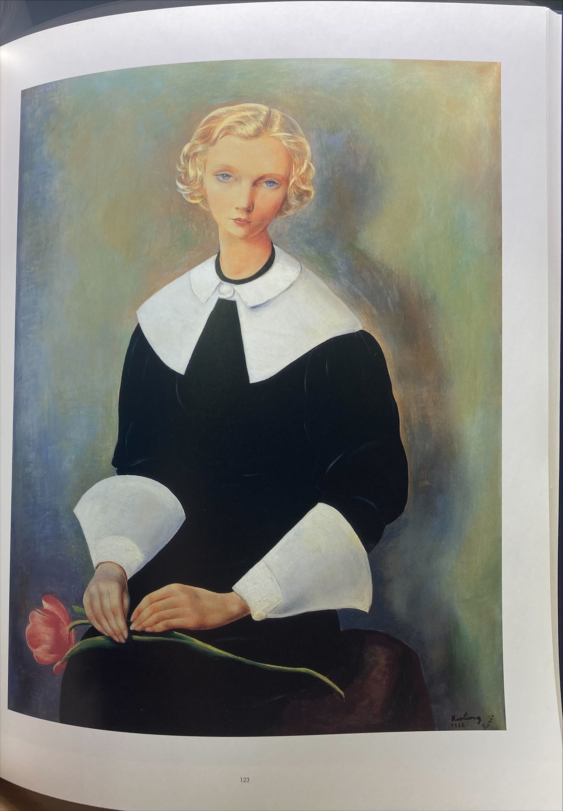
この絵は名画中の名画だと思いますが、現在展示している美術館はありません。スイスのプチパレ美術館の機嫌次第です。同じ絵が二つあるらしい。  
**ブイヤベース**

この絵は、マジですごいですがどこ所蔵なのかさっぱりわかりません。  
**カタログレゾネでしか見たことない絵（インターネット初の画像ばっかりだと思います。読者サービス大出血です）**
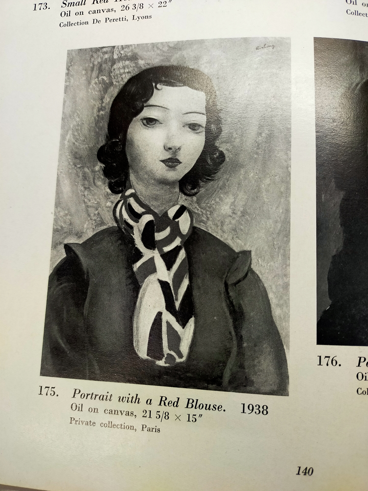
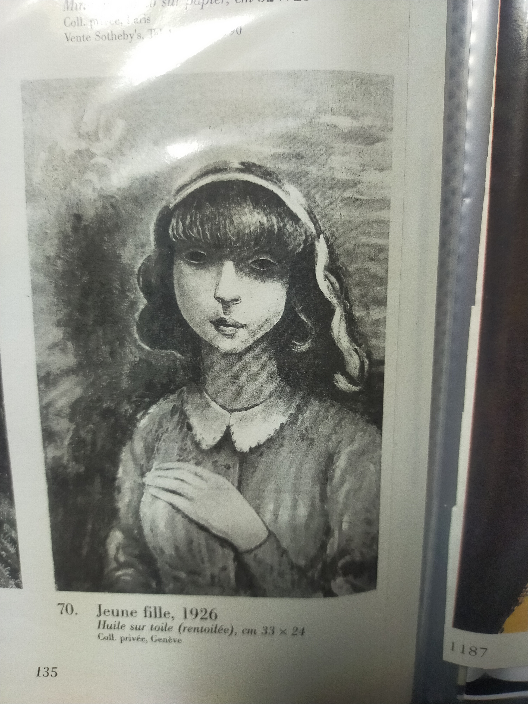
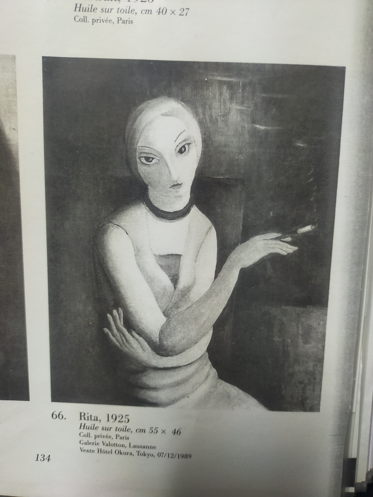
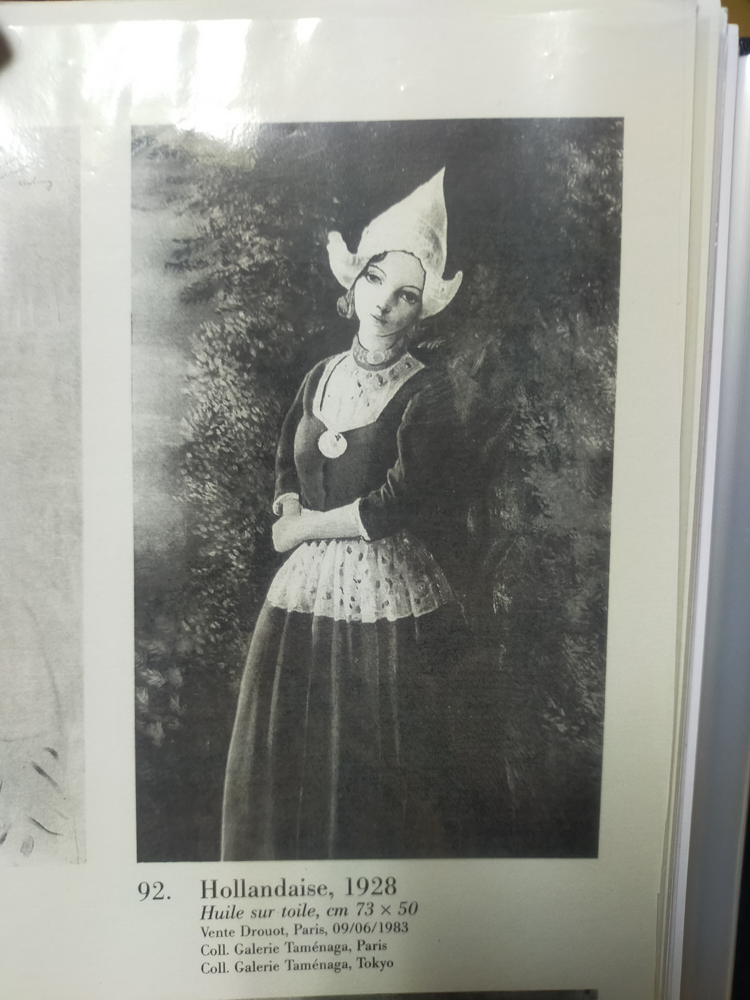
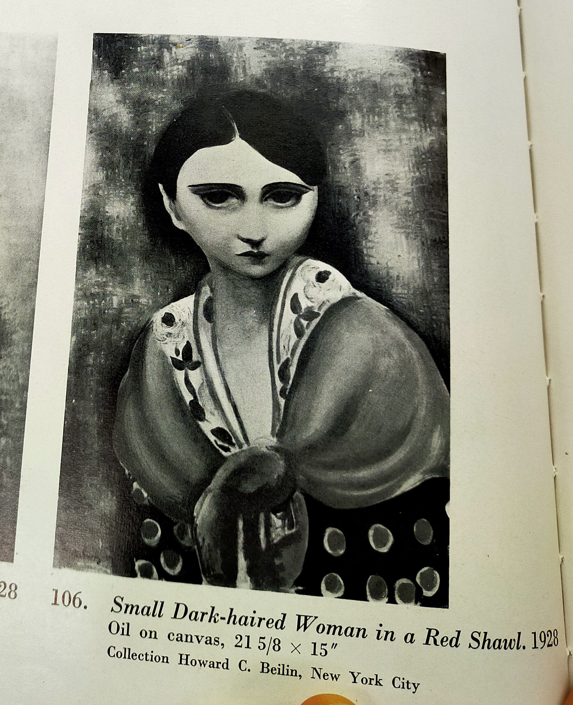
キスリングの絵はダークさと言葉にできない上品さがあって、ワクワクしますよね。いずれ、これらの絵の色遣いやマチエルを知れたらいいなと思います。  
最後に、キスリングの名言「私は、いつの日か、一枚の裸婦像を前にして、見る人がそれは娼婦か、職業的モデルか、あるいは社交界の婦人なのか、見分けられるところにまで達することができると思う」
についての感想を。実は、私も娼婦を絵にしたいなとひそかに夢見ています。娼婦はオナクラ嬢がいいです。何故なら、オナクラ嬢は私が好きな日本独特の文化だからです。
最近の写実の画家は、娼婦を書かないで、佳乃とか職業モデルばっかりを書いていることが、気に入らないです。同じモデルを様々な人気作家が共有していることは理解できますが、同じモデルの作品が多すぎです。

