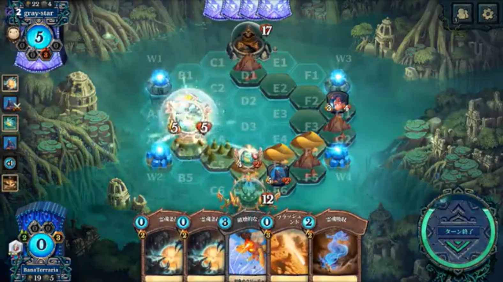

+++
title = "人生で一番プレイしたPCゲーム"
date = 2026-10-12T00:00:00+09:00
draft = false
tags = ["休日", "ゲーム", "PCゲーム", "幼少時代"]
+++
今日は朝5時30に掃除があっただけで、函館でお休みでした。そこで、昼過ぎからお風呂に行きました。函館で行った場所は、明日まとめて記事にするとして、今日は職場の雑談にはならないけどよく思い出す話を書くことにします。
私は結構ゲームをプレイする方です。携帯機よりPCでプレイするゲームが好きです。PCでやるゲームは画面も大きいし、すぐネットで調べられるし、快適だからです。
ただ、私はあまり一つのゲームに熱中するタイプではありません。面白いゲームでも50から100時間ほどで飽きが来てしまいます。理由は、目的がなくなってしまうからです。なので、飽きずにたくさんプレイしたゲームは思い出深いのです。
私が、プレイしたPCゲームの中で二つ、続けられるものがありました。
一番は、大学1年生の時に奨学金で購入した「ハニーセレクト2」と「Room Girl」という同じ会社のエロゲーです。これについては、また今度書きます。
今回紹介するのは、おもに中学3年生の間にプレイしていた「Faeria」というゲームです。Faeriaは、デジタルカードゲームでシャドウバースと同じジャンルのゲームで、Abrakamという会社が作っているゲームです。500時間以上プレイしました。  
ゲームについて紹介する前に、私の中学3年生の頃を振り返ってみます。当時日記を書いていなかったので、時系列は何となくです。
私が小4の頃、兄が中学受験の合格祝いに買ってもらったゲーミングPCがありました。
当時はスマホやSwitchでマイクラができず、PCかXboxくらいしか選択肢がなかった時代です。
そのPCは私が中学生になる頃には使われなくなり、リビング横の母の和室に、デスクごと置かれていました。
遠くの相手と協力したり、ゲームを配信することに憧れがあった私は、次第に毎日のようにPCを利用するようになりました。
自分の部屋がなかった私にとってゲーミングPCとその周りだけが、安心できるスペースの様になっていたように思います。
これが、私のゲーム環境です。
そして、中学生のころまでどんな活動をしていたのかを説明します。
中学3年生の夏頃までは、陸上をやっていたのですが、夏休みを過ぎてから暇を持て余していました。
詳しく言うと、夏合宿に耐えかねて運動部を退部した私は、中学1年生の10月ごろから小学校で仲良かった同級生に誘われて小さな会で運動するようになりました。
そこでは、同級生とその友達、そして体育を大学で教えてる友達の親と4-5人ほどで、競技ではなく、健康の向上を目指してハードル走や短距離走をやっていました。会費は競技場の貸し出し費の割り勘代だけでした。  
しかし、他の同級生は高校受験組だったので、中3の夏休みを期に解散することになりました。そこからは月に2回秋葉原でパソコンで音楽を作る教室に通ったりしていました。
この二つの活動は、陸上やってた。とか、DTMやってた。とか言えば職場でも雑談のネタにすることが出来ますね。しかし、今回話したいのは空白期間にハマっていたゲームについての誰とも共有できない闇のエピソードです。

それがFaeriaというゲームです。
**Faeriaはゲームとして面白かった**  
私は結構いろんなカードゲームをプレイしましたが、唯一無二の魅力が沢山あったカードゲームだと思っています。

まず、プレイしたカードを自分が操っている、と言う感覚がとても高かったです。1ターンに1度プレイしたクリーチャーを移動したり、攻撃することが出来ます。それも、はじめは何もないマップの上に自分で床タイルを作って、その上を動かします。
戦術によって、クリーチャーの動かし方はだいたい決まっているのですが、かなり自由度が高く、プレイするだけで自分の駒だと思えるような動きをしてくれました。
そして、このゲーム最大の特徴であるパワーホイールが神ゲーでした。

毎ターンタイルを置くか、ドローするか、マナを一つ追加するか選べるのですが、この選択が勝敗に直結するうえ、どの選択も捨てがたいという稀有なバランスでした。
つぎに、カードデザインも秀逸で今でも好きなカードはいくつかあります。
  
このカードは、飛行と襲撃５をもち、盤面の端から端まで簡単に移動できる機動力を持つうえ、ETBで自軍かどうかを問わずクリーチャーを動かすこともできます。色拘束と「特別感」という報酬が噛み合っていると思えるデザインです。
  
跳躍しか能力がついていませんが、コスト、スタッツ、色拘束すべてが噛み合い広く使われていたカードです。イラストも味があります。
  
クジラが相手のクリーチャーを飲み込む。倒すとそれが出てくるという、非常に分かりやすいデザインだと思っています。  
最後に、カードが簡単に集まる事から、資産の多寡で勝敗が決まりにくい。という純度の高さも私にあっていました。
**Faeriaのコミュニティ**
面白いゲームは沢山ありますが、Faeriaを長く続けられた理由として、コミュニティがあったからだと思っています。 
中学3年生のころTwitchで別のPCゲームを配信したりしていましたが、Faeriaに興味を持ち、コミュニティに参加したところ、とても暖かく迎え入れてくれました。
たとえば、スクリーンショットを送って、質問をすれば、複数人が丁寧に教えてくれました。
また、常に配信をしているFaeria魔人の方が数人いて、それがリアルタイムで更新されるコンテンツのようになり、興味を持続できました。そして、自分が配信しても誰かがコメントを残してくれました。
そこで、高校受験もない私は、自身のチャンネルでFaeriaをメインで配信するようになりました。
さらに、やりとりのなかで、同じ趣味を共有するもの同士で連帯感が強くなり、Faeriaに限らずいろいろなストラテジーゲームを遊ぶようになりました。
そこで教えてもらったPrismata, Artifact（当時は3本レーン）, TFT, Mythgardなどのゲームは私の生活の範囲では見たことも聞いたこともありませんでしたが、とても面白くて、私の好奇心を刺激したように思います。
こんな感じで、Faeriaは私にとって部活や居場所代わりになったゲームなのです。 
**思春期に過疎ゲーに打ち込むことの功罪**  
今までの話で、誰もやってなかったとしても、良いコミュニティに入ることが出来、楽しいゲームも見つけられたならいい話だろう。と思われるかもしれませんが、中学生当時は不満でいっぱいでした。
まず、自分の自信やアイデンティティが中々保てませんでした。なぜなら、中学生のオタクの考え方に、「身の回りで広まっているもの＝良いもの・価値の高いもの」という図式があるからです。
布教と言って友達に自分の嗜むコンテンツを共有して仲間を作ることは皆することです。しかし、常時接続数が100人程度のゲームを毎日やっていても、同じことをしている人は周りに誰もいないし、
PCで、discordで、ストラテジーで、と言って誘ってプレイできる人もいませんでした。なので、自分の毎日やっていることが、誰にも共有できず、社会的価値も低い事なんだ。と思う事が多くなり自信やアイデンティティを保つことが難しくなりました。
確かに、様々な制作を通して、コンテンツが広まることが良いこととは限らないとわかったり、自分に合うものが何かわかってきた今では、自信を持って時間を使うものを選ぶことが出来ます。
しかし、中学生ではどうしてもそのように切り替えて考えるのは難しかったのだろうと思います。
また、周りへの不満も高まりました。なぜなら、身の回りの人が私が打ち込んでいることを理解できなかったからです。
というのも、部活をやっていれば、競技名を言うだけで、ある程度は伝わりますし、話を共有できます。しかし、誰もやっていないゲームで会ったことないオッサンと仲良く遊んでいるということは、こと細かに説明をしなければなりません。
それは今よりさらに口下手だった幼少期には難しかったです。たとえば、「Faeriaが神ゲーすぎる。」と言ったり会社名の「Abrakam（アーブラカーム）」と叫ぶくらいのことしかできませんでした。だから、他の人から何をやっているのかわからない人と思われていたのだろうと思っています。
つまり、Faeriaをやっていた時代はリアルに仲間がいない、周りは何もわかってくれない。という状況が長く続いたのです。それは、捻くれたり、不適応になる一因になっていました。　　

まとめると、承認や理解が大事な中学生の時に過疎ゲーにハマったことで、不満を持つことが増え、自分のことが分かって自信をもてるようになるまで、なかなか芽を出すのが遅くなりました。
しかし、今では、Faeriaのコミュニティを通して知ったことや、不満を通していち早く自分の個性を深く知れたことは、自分の人生をよくしてくれたと思っています。

