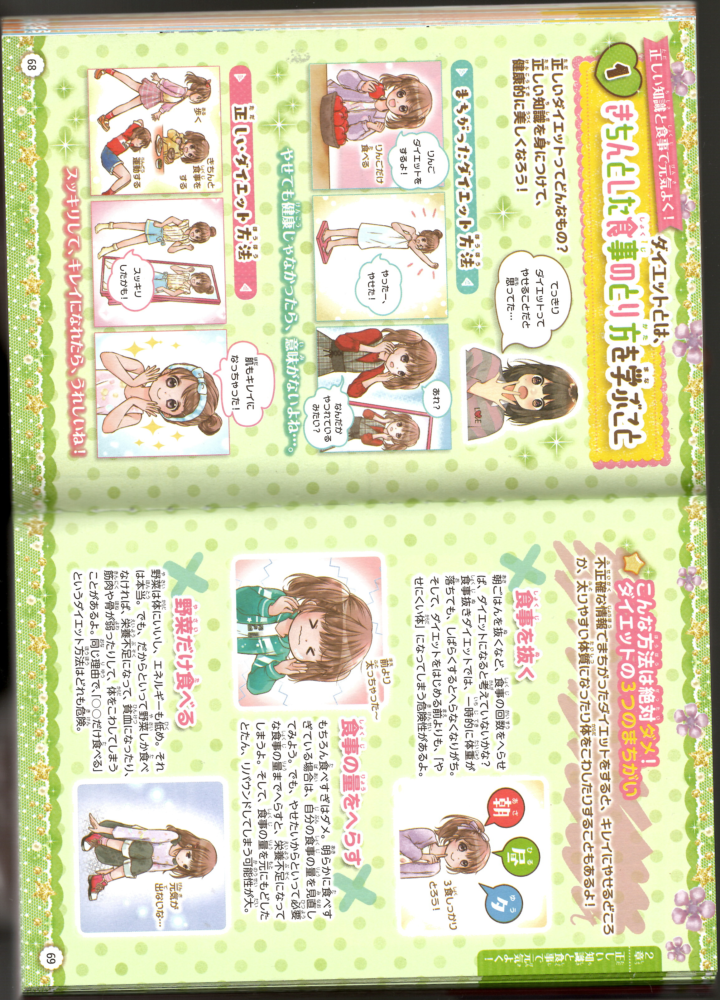
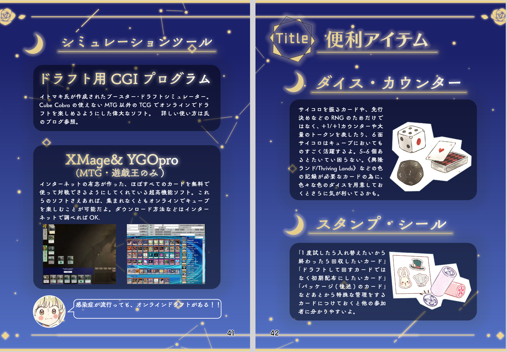

+++
title = "管鍼法とさんぷるキューブ"
date = 2026-10-17T00:00:00+09:00
draft = false
tags = ["船", "仕事", "制作論", "障害科学", "大学での学び"]
+++
今日は仕事で主機のかけ方をイメージトレーニングにて練習しました。
- エアタンクを開ける
- 主機予備LOポンプを警報解除を押しながら起動する
- 減速機予備LOポンプを起動する
- 潤滑油のゲージを見てターニングする
- エアランする
- インジケータコックを閉める
- 海水ポンプと清水ポンプを起動して、減速機予備LOポンプを停止する
- 燃料ハンドルを開けて、始動ハンドルを起動位置まで持っていく
- エアーを送り、燃料ハンドルを運転に持っていく
- 主機予備LOポンプを停止して、自動にする
- 問題ないかを確認して制御をブリッジに切り替える
- エアタンクをしめる  
明日はそれを実際にやるそうです。
そして、またいろいろなことを教わりました。まずは、潤滑油の仕組みについてです。
エンジン下部にあるオイルパンに使われたLOが溜まります。補機では、それを直接検油棒で残りの油量をチェックします。
検油棒には、上下に印がついていて、その間に油面が残るのが正常な油量という事になっています。
主機についてはオイルパンからサンプタンクに流れ込み、LO清浄機と循環します。サンプタンクに検油棒に似たはかりがついています。
つぎに、海水系統について教わりました。喫水線という言葉を知りませんでしたが、船体が水に漬かっている高さのことを言います。
喫水線より低い場所にはポンプを使わなくても海水が入り込むので作業時は常にバルブの開閉を意識する必要があると教わりました。
海水系統は、給水バルブと、それを流す排水のバルブが必ずあるので、それを意識してその間にあるバルブを一つ一つ確認していくとわかるようになる。と教わりました。
また、海水ポンプや系統は故障しやすいので、エンジンに供給する際は、ポンプを付けた際に圧力計でも確認しなければならない。と教わりました。
また、エンジン冷却水はエンジンに付属したポンプだけでなく、雑用水ポンプから引いてくることもできると教わりました。  
一応、ポンプのグランドパッキンとメカニカルシールの違いも教わったのですが、交換できるかできないかくらいかの違いで、いまいちわかりませんでした。  

今日の小噺は、昨日の話を書いて思い出したことです。高校生の時からなんとなく、「人は能力を失う事で逆に才能を開花させられる」という発想を持っていました。
それが大学に入って確信に変わった話をしていきたいと思います。
まず、私は大学では障害科学を専攻しました。
障害科学というのは、障害者福祉、障害者教育、障害原理論など様々な方向で障害を考えることで社会問題や人間そのものについての理解を深めるという学問です。
私は特別支援教育学を修めたので、一応特別支援学校の教員免許を持っているんです。船員になっているのに、どうして教員免許を取るところまで頑張れたのかというのはまた今度話します。

私は、大学1年生の頃「さんぷるキューブ」という本を書きました。それは、人生で0から1を生んだ唯一の経験とも言っていいような本です。
どうして、そう言えるかという理由を説明します。
私は、昔から読みが苦手でした。例えば、中学生でやった英文多読の課題では下から2個目のレベルから進まず、社会科でもらう文字だけのプリントに関しては、全く頭に入りませんでした。
なので、読みたくなる工夫をしてこない教科書や参考書、課題図書に囲まれることとなった中学生時代に本そのものが嫌いになり、図書館にも入りにくいような中高生になっていました。
しかし高校生ごろから、白黒の細かい活字本が憎いことで本全体を憎むという考え方は恥ずかしいと思い、色々手に取りやすいものを探すようになりました。
そうすると、読めることもある児童書に気持ちが切り替わり、本屋の児童書コーナーには行けるようになってきました。
そこで、「モデルみたいにかわいくなれるおしゃれガールのキレイLesson」という本に高2の2月に衝撃的な出会いをしました。

読んでみると情報の入れ方や色遣い、キャラの配置などが読みたくなる・読める構成だったのです。また、それらの表現方法が既存の本とは思想が全く異なる事も気付きました。

高校生の頃はそれで終わったのですが、大学1年生の頃にこの発見が再燃します。
というのも、大学で読みにくさによって、他の子と同じように履修登録ができなかったのです。合理的配慮も試みましたが、どうにも自分に合わず挫折しました。
しかし、読みにくさを主張するにも、「自分が読みやすいもの」を知らないとダメだな。と思えるようになりました。
そこで、思い出したのが、高校生の頃の発見です。女児本を参考にした自身で本制作に踏み切ったのです。さらに、「モデルみたいにかわいくなれる～」のような本を資料用として集めるようになりました。
すると、高校2年生から大学1年生の間に、先に紹介したような「女子向けのよみもの（通称女児本）」が表現方法について、とてつもない進化をしていたことを発見します。
この発見は、ネットでまとめられたりしておらず、未だに一般には広く知られていません。  

「さんぷるキューブ」はその女児本スタイルを研究し、自分の好きだったカードゲームの内容にしたものです。（本当はこの本にはもう二つ世界初があるのですが、一日の記事におさまらないので、止めておきます。）
自分の好きなスタイルで、好きな内容を入れた本を制作し、自分にとっての「読みたい」を見つめなおしたことで、誰も知らなかった発見をし、その文化の一員となったという証左になっています。
だから、この本の制作は自分の困難から生まれた新しい視点によって生まれた0から1を生んだ経験なのです。
また、この本は、今まで自分がどんなにユニークな経験をしても、主観でしかなかったことが揺るがない物質として残った経験でもあったのです。
この本を書いてから3か月後に、ずっと感じていた希死念慮が流れ去り、その1か月後には、女性人格に憑依されるという人生を変えた精神体験をしています。この本の前後で人生すべてが変わったと言える本なんです。  

そんな感じで大学1年生を終えましたが、のちの障害科学の授業で自分の正当性を確信することになります。
それは視覚障害教育の歴史の授業の時間でした。視覚障害の歴史で必ず登場するのが、杉山和一と管鍼法についての逸話です。
あらましはこうです。杉山和一は武家に生まれましたが目を悪くして盲になります。しかし、琵琶法師や按摩士ではなく、鍼医を志します。そこで、同じく盲人の鍼医、山瀬琢一に入門しましたが覚えが悪く、破門されてしまいます。
失意の中山籠もりしていると、松葉の入った筒のようなものを手にし、管を通して鍼を打つ管鍼法を構想します。
それ以前の鍼は、長く太い鍼を刺すもので、非常に高い技量が必要なうえ、危険も伴いました、管鍼法が確立すると多くの人が鍼を扱えるようになり、医療事故も減りました。
17世紀初めの出来事ですが、現在でも鍼の主流のやり方として残っています。（なぜ杉山和一が歴史に登場するかというと、当道座を再編したり、教育を拡充した功績があったからです。）  

公益性の規模は大きな差がありますが、杉山和一の管鍼法も私のさんぷるキューブもたいして変わりません。何故なら、どちらも自分の困難や障害によって生まれた疑問や悩みを逆に新たな発見や強みに変えているからです。
私は、困難があったことで他の本と女児本との違いが分かるほど感性が先鋭化していたと考えています。
同様に考えると、杉山和一も多分障害があった事で、他の人より今の鍼の技法に疑問を深め、ついに世を変える発明をしたのだろう。と思います。
さんぷるキューブの1ページ    

まとめると、大学時代、自分が困難から生まれた感性で、実際に特殊な発見をしました。また、それを杉山和一の逸話と照らし合わせて考えました。
すると、自らの「人は能力を失う事で逆に才能を開花させられる」というアイデアは間違っていないな。と思えるようになりました。
大学1年生の時点で障害科学の奥義を体得していたと言っても過言ではないのです。そのくらい高校3年生から大学1年生にかけての私は天才だったんです。  

